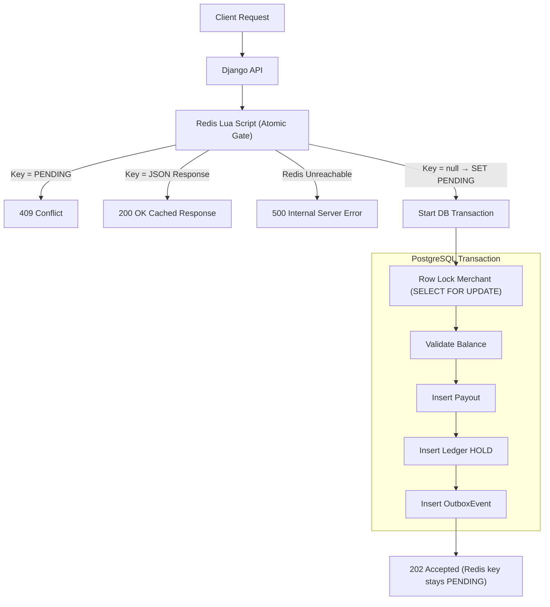
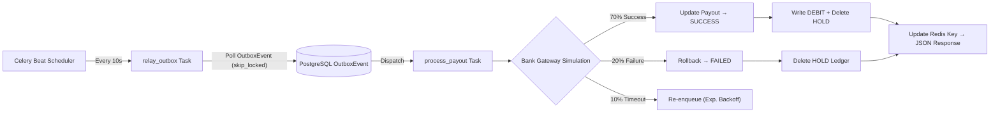
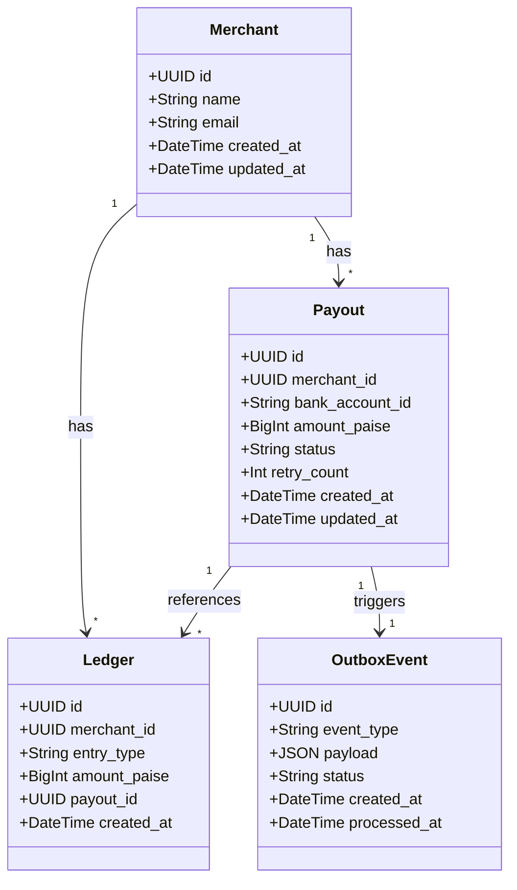
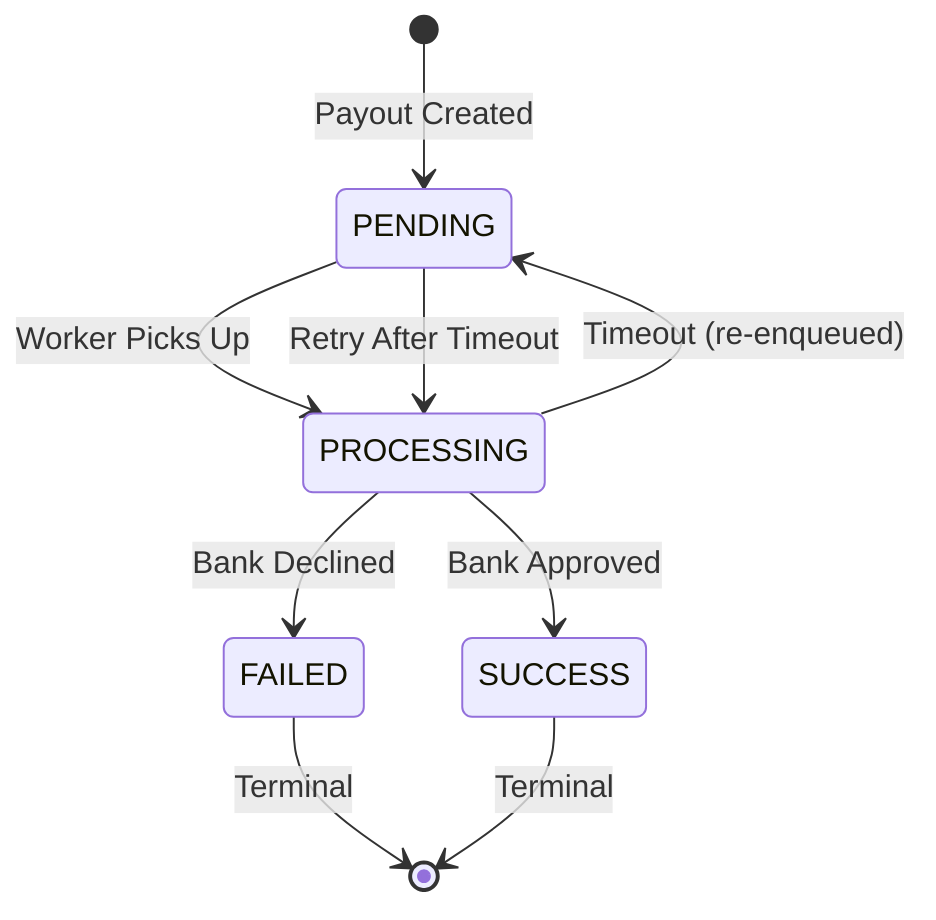

# Playto Payout Engine

A payment engine simulation designed with robust financial systems in mind, built using Django, DRF, PostgreSQL, Celery, and Redis. It features exact-once processing, Redis-based atomic idempotency using Lua scripts, strict row-level locking for balance management, and a transactional outbox pattern to guarantee event delivery.

---

## Architecture Overview

The system is designed to handle high concurrency without race conditions, overdrawn accounts, or duplicate processing. Below is a high-level architecture diagram showing how the React dashboard, Django API, PostgreSQL, Redis, and Celery workers interact:


The diagram above illustrates the complete request lifecycle: a client (React dashboard) submits a payout request to the Django API gateway, which first consults Redis using an atomic Lua script for idempotency. If the request is new, a PostgreSQL transaction creates the payout record, a ledger `HOLD` entry, and an `OutboxEvent` — all atomically. The Celery Beat watchdog polls the outbox every 10 seconds, dispatching events to the payment processing worker via the Redis queue. The worker simulates a bank gateway with three outcomes: **SUCCESS (70%)**, **FAILED (20%)**, or **HANG/timeout (10%)** with exponential backoff retry.

---

### Client → Backend Request Flow

The flowchart below traces every possible path a payout request can take from the client to the final HTTP response. This is the synchronous portion of the system — the client receives an immediate acknowledgement while actual processing happens asynchronously.



**How to read this diagram:**

1. Every payout request first hits the **Redis Lua script** — a single atomic operation that checks if an idempotency key already exists.
2. If the key is `PENDING`, another request is already in-flight → return **409 Conflict**.
3. If the key contains a JSON response (written by the Celery worker after processing), replay it as **200 OK** — this is the idempotent replay.
4. If Redis is unreachable, the system **cannot safely proceed** without the idempotency gate → return **500**.
5. If the key doesn't exist, set it to `PENDING` and proceed into a **single PostgreSQL transaction** that acquires a row-level lock on the merchant, validates the balance, and atomically inserts the payout, a `HOLD` ledger entry, and an outbox event.
6. The client receives **202 Accepted** immediately — actual bank processing happens asynchronously.

---

### Celery Outbox Worker Flow

This diagram shows the asynchronous background processing pipeline. Once the synchronous API request is done, the Celery infrastructure takes over to actually "send" the payout to the bank.



**How to read this diagram:**

1. **Celery Beat** fires the `relay_outbox` task every 10 seconds, which polls PostgreSQL for unprocessed `OutboxEvent` rows using `skip_locked` (preventing multiple workers from grabbing the same event).
2. Each event is dispatched as a `process_payout` Celery task into the Redis queue.
3. The worker simulates a bank gateway with three probabilistic outcomes:
   - **Success (70%)** — the payout status is updated to `SUCCESS`, a `DEBIT` ledger entry is written, and the `HOLD` entry is removed.
   - **Failure (20%)** — the payout status is set to `FAILED`, and the `HOLD` entry is deleted (balance is released back).
   - **Timeout (10%)** — the task is re-enqueued with exponential backoff for retry.
4. On terminal states (SUCCESS or FAILED), the Redis idempotency key is updated from `PENDING` to the final JSON response, enabling future idempotent replays.

---

### Key Architectural Decisions

1. **Redis-Only Idempotency**: An atomic Redis Lua script acts as the sole idempotency gate. If the key exists as `PENDING`, return `409 Conflict`. If it contains JSON (written by the Celery worker), replay it as `200 OK`. **If Redis is unreachable**, the API returns `500 Internal Server Error` — it cannot safely proceed without the idempotency gate.

2. **Ledger Over Mutable Balance**: Balances are derived dynamically using `SUM()` aggregations on an append-only `Ledger` rather than storing a mutable integer, eliminating race conditions.

3. **Pessimistic Row-Level Locking**: PostgreSQL's `SELECT ... FOR UPDATE` ensures only one request modifies a merchant's ledger at any given moment.

4. **Transactional Outbox Pattern**: An `OutboxEvent` is committed within the same transaction as the ledger hold. A Celery worker later relays these events, guaranteeing *exactly-once* delivery.

5. **Worker-Driven State Finalization**: The Celery worker updates the Redis idempotency key from `PENDING` to the final JSON response once the payout reaches a terminal state (`SUCCESS` or `FAILED`).

---

### Data Model

The class diagram below shows the four core database models and their relationships. All IDs are UUIDs. The `Merchant` is the top-level entity that owns payouts and ledger entries. Each `Payout` generates exactly one `OutboxEvent` for asynchronous processing, and can reference multiple `Ledger` entries (a `HOLD` on creation, then a `DEBIT` or deletion on resolution).



**Key relationships:**
- A **Merchant** can have many payouts and ledger entries. The merchant's available balance is computed as `SUM(ledger entries)` rather than stored as a mutable field.
- Each **Payout** starts with a `HOLD` ledger entry (reserving funds) and ends with either a `DEBIT` (on success) or deletion of the hold (on failure).
- Each **Payout** triggers exactly one **OutboxEvent**, ensuring the async processing is guaranteed to fire even if the worker is temporarily down.

---

### Payout State Machine

This state diagram shows the lifecycle of a single payout. A payout can only move forward through these states — there are no backward transitions except for the timeout retry loop between `PROCESSING` and `PENDING`.



**State descriptions:**
- **PENDING** — The payout has been created and is waiting for a Celery worker to pick it up from the outbox.
- **PROCESSING** — A worker has claimed the payout and is simulating the bank gateway call.
- **SUCCESS** — The bank approved the transaction. The ledger is updated with a `DEBIT` entry and the `HOLD` is removed. This is a terminal state.
- **FAILED** — The bank declined the transaction. The `HOLD` ledger entry is deleted, releasing the reserved funds back to the merchant. This is a terminal state.
- **Timeout loop** — If the bank gateway hangs (10% probability), the payout is re-enqueued back to `PENDING` with exponential backoff, and the cycle repeats.

---

## Docker Containers

The full stack runs as **7 containers** via `docker-compose.yml`:

| Container          | Image / Build          | Port  | Purpose                          |
|--------------------|------------------------|-------|----------------------------------|
| `playto-postgres`  | `postgres:15`          | 5432  | Primary database (persistent volume) |
| `playto-redis`     | `redis:7-alpine`       | 6379  | Celery broker + idempotency gate |
| `playto-backend`   | `./Dockerfile`         | 8000  | Django API server (Gunicorn)     |
| `playto-celery-worker` | `./Dockerfile`     | —     | Payout processing worker         |
| `playto-celery-beat`   | `./Dockerfile`     | —     | Periodic outbox relay scheduler  |
| `playto-flower`    | `./Dockerfile`         | 5555  | Celery Flower monitoring dashboard |
| `playto-frontend`  | `./web/Dockerfile`     | 5173  | React dashboard (Vite)           |

### Start all containers
```bash
docker compose up -d
```

### Stop all containers
```bash
docker compose down
```

### Access Points
| Service           | URL                        |
|-------------------|----------------------------|
| Django API        | http://localhost:8000       |
| React Dashboard   | http://localhost:5173       |
| Flower Dashboard  | http://localhost:5555       |

---

## Celery Flower Monitoring

[Flower](https://flower.readthedocs.io/) is a real-time web-based monitoring tool for Celery. It provides visibility into:

- **Active workers** — see which workers are online, their status, and task throughput
- **Task history** — view all executed tasks with arguments, results, and execution times
- **Task queues** — monitor queue depths and consumer counts
- **Worker resource usage** — CPU, memory, and task prefetch counts

### Running Flower

**In Docker (part of the full stack):**
```bash
docker compose up -d
# Flower is available at http://localhost:5555
```

**Locally (for development):**
```bash
make flower
# or directly:
celery -A playto flower --port=5555
```

The dashboard will be available at **http://localhost:5555**. No authentication is configured by default — add `--basic-auth=user:password` to the command for basic HTTP auth if needed.

---

## Local Development Setup

For local development, only PostgreSQL and Redis run in Docker. The Django server, Celery, and the frontend run natively.

### Prerequisites
- Docker & Docker Compose
- Python 3.12+ with a virtual environment
- Node.js 20+
- GNU Make (or use the commands directly)

### 1. Start Databases
```bash
make db-start
```

### 2. Activate Virtual Environment & Install Dependencies
```bash
# Windows
.\.venv\Scripts\activate
pip install -r requirements.txt

# macOS/Linux
source .venv/bin/activate
pip install -r requirements.txt
```

### 3. Run Migrations & Seed Data
```bash
make migrate
make seed
```

### 4. Start Services (each in a separate terminal)

| Terminal | Command              | Description                           |
|----------|----------------------|---------------------------------------|
| 1        | `make server`        | Django API on `localhost:8000`         |
| 2        | `make celery-worker` | Celery worker (solo pool)             |
| 3        | `make celery-beat`   | Celery Beat scheduler                 |
| 4        | `make frontend`      | Vite dev server on `localhost:5173`   |
| 5        | `make flower`        | Flower dashboard on `localhost:5555`  |

Create a `.env` file inside `web/` with your merchant UUID:
```
VITE_MERCHANT_ID=<your-merchant-uuid>
```

> **Note:** All environment variables (`DATABASE_URL`, `REDIS_URL`, `DEFAULT_MERCHANT_ID`) have local defaults baked into `settings.py`. You can run the app without a `.env` file as long as PostgreSQL and Redis are available on `localhost`.

---

## Makefile Commands Reference

### Database Services
| Command         | Description                                        |
|-----------------|----------------------------------------------------|
| `make db-start` | Start PostgreSQL and Redis containers (detached)   |
| `make db-stop`  | Stop PostgreSQL and Redis containers               |
| `make db-logs`  | Tail logs from database containers                 |

### Django Backend
| Command        | Description                      |
|----------------|----------------------------------|
| `make server`  | Start the Django development server |
| `make migrate` | Run Django database migrations   |
| `make seed`    | Seed the database with test data |

### Celery & Monitoring
| Command              | Description                                  |
|----------------------|----------------------------------------------|
| `make celery-worker` | Start Celery worker (solo pool for Windows)  |
| `make celery-beat`   | Start Celery Beat scheduler                  |
| `make flower`        | Start Flower monitoring dashboard (port 5555)|

### React Frontend
| Command                 | Description                    |
|-------------------------|--------------------------------|
| `make frontend-install` | Install frontend npm dependencies |
| `make frontend`         | Start the Vite dev server      |

### Full Docker Stack
| Command            | Description                    |
|--------------------|--------------------------------|
| `make docker-up`   | Start all 7 containers         |
| `make docker-down` | Stop all containers            |
| `make docker-build`| Rebuild all Docker images       |
| `make docker-logs` | Tail logs from all containers  |

### Utilities
| Command       | Description                              |
|---------------|------------------------------------------|
| `make test`   | Run Django test suite                    |
| `make clean`  | Remove Docker volumes and stopped containers |
| `make help`   | Show all available commands              |

---

## Running Tests
Run the test suite using `testcontainers` to automatically spin up an isolated PostgreSQL instance:
```bash
make test
# or directly:
python manage.py test api
```
