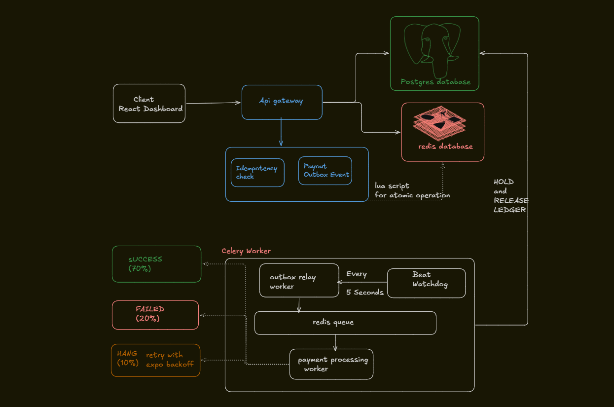
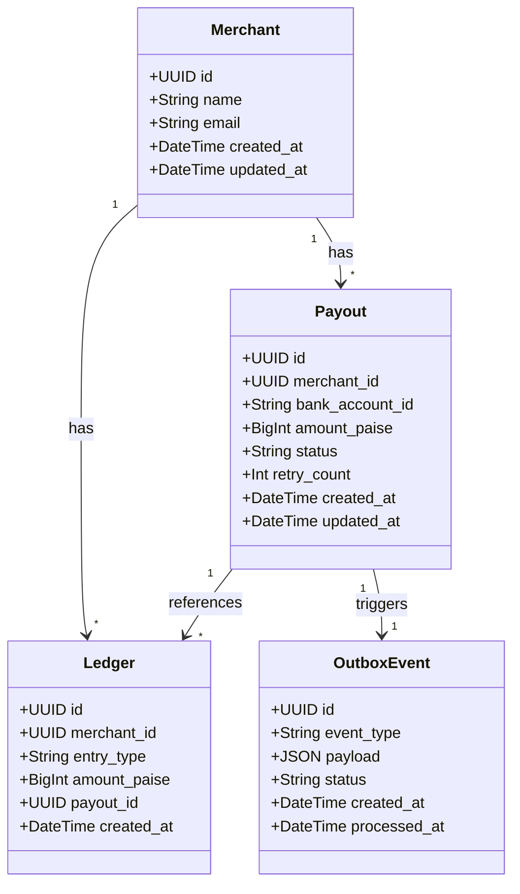
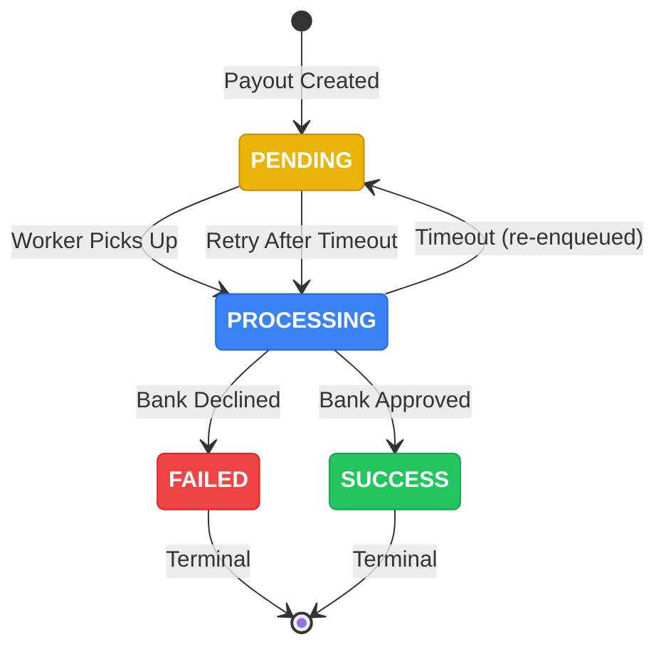

# Playto Payout Engine


A payment engine simulation designed with robust financial systems in mind, built using Django, DRF, PostgreSQL, Celery, and Redis. It features exact-once processing, Redis-based atomic idempotency using Lua scripts, strict row-level locking for balance management, and a transactional outbox pattern to guarantee event delivery.


## Summary

The Playto Payout Engine is designed with institutional-grade reliability, ensuring exact-once processing and absolute financial safety under high concurrency. 

**Core Technical Value Drivers:**
* **Zero Race Conditions:** The system models balances via an append-only Ledger rather than a mutable row. Pessimistic PostgreSQL row-level locks (`SELECT FOR UPDATE`) strictly prevent overdrawing, even during simultaneous API requests.
* **Exact-Once Execution:** An atomic Redis Lua script acts as an impenetrable idempotency gate, blocking duplicates at the cache layer with zero database penalty. 
* **Guaranteed Delivery:** A Transactional Outbox pattern guarantees that if a payout is committed to the database, the asynchronous background worker (Celery) *will* process it. Event drops are impossible.
* **Self-Healing Mechanics:** Bank gateway timeouts are automatically caught, retried with exponential backoff, and eventually rolled back securely, releasing held funds without manual intervention.

### Excalidraw Architectural Views
* [System Architecture & Request Flow](https://excalidraw.com/#json=EjRPUH-sWry3fIVb3e9YM,VFk4zS4x4JUnVj_3BDB0oQ)
* [Asynchronous Outbox Worker Flow](https://excalidraw.com/#json=nMBeTO-nHBwOj4AS2VSud,2eVD2YNcXo1LsPeoznoXvg)
* [Data Model & Relationships](https://excalidraw.com/#json=SwsIu7v4eMhaF8rhoEK5L,cWFUJy9PwxCINciWuCVFRg)


## Architecture Overview

The system is designed to handle high concurrency without race conditions, overdrawn accounts, or duplicate processing. Below is a high-level architecture diagram showing how the React dashboard, Django API, PostgreSQL, Redis, and Celery workers interact:




### Client → Backend Request Flow

The flowchart below traces every possible path a payout request can take from the client to the final HTTP response. This is the synchronous portion of the system — the client receives an immediate acknowledgement while actual processing happens asynchronously.

```mermaid
flowchart TD
    %% Define colors
    classDef default fill:#1E293B,stroke:#475569,stroke-width:1px,color:#E2E8F0;
    classDef client fill:#0ea5e9,stroke:#0284c7,stroke-width:2px,color:#ffffff;
    classDef redis fill:#ef4444,stroke:#dc2626,stroke-width:2px,color:#ffffff;
    classDef error fill:#f97316,stroke:#ea580c,stroke-width:2px,color:#ffffff;
    classDef success fill:#22c55e,stroke:#16a34a,stroke-width:2px,color:#ffffff;
    classDef db fill:#3b82f6,stroke:#2563eb,stroke-width:2px,color:#ffffff;
    
    Client[Client Request]:::client --> API[Django API]
    API --> RedisLua["Redis Lua Script (Atomic Gate)"]:::redis
    
    RedisLua -- "Key = PENDING" --> Conflict[409 Conflict]:::error
    RedisLua -- "Key = JSON Response" --> OK[200 OK Cached Response]:::success
    RedisLua -- "Redis Unreachable" --> ServerError[500 Internal Server Error]:::error
    RedisLua -- "Key = null → SET PENDING" --> DB_Tx[Start DB Transaction]:::db
    
    subgraph PostgreSQL Transaction
        DB_Lock["Row Lock Merchant (SELECT FOR UPDATE)"]
        DB_Bal[Validate Balance]
        DB_Payout[Insert Payout]
        DB_Ledger[Insert Ledger HOLD]
        DB_Outbox[Insert OutboxEvent]
    end
    style PostgreSQL Transaction fill:#0f172a,stroke:#3b82f6,stroke-width:2px,stroke-dasharray: 5 5
    
    DB_Tx --> DB_Lock
    DB_Lock --> DB_Bal
    DB_Bal --> DB_Payout
    DB_Payout --> DB_Ledger
    DB_Ledger --> DB_Outbox
    
    DB_Outbox --> Return["202 Accepted (Redis key stays PENDING)"]:::success
```



**How to read this diagram:**

1. Every payout request first hits the **Redis Lua script** — a single atomic operation that checks if an idempotency key already exists.
2. If the key is `PENDING`, another request is already in-flight → return **409 Conflict**.
3. If the key contains a JSON response (written by the Celery worker after processing), replay it as **200 OK** — this is the idempotent replay.
4. If Redis is unreachable, the system **cannot safely proceed** without the idempotency gate → return **500**.
5. If the key doesn't exist, set it to `PENDING` and proceed into a **single PostgreSQL transaction** that acquires a row-level lock on the merchant, validates the balance, and atomically inserts the payout, a `HOLD` ledger entry, and an outbox event.
6. The client receives **202 Accepted** immediately — actual bank processing happens asynchronously.


### Celery Outbox Worker Flow

This diagram shows the asynchronous background processing pipeline. Once the synchronous API request is done, the Celery infrastructure takes over to actually "send" the payout to the bank.

```mermaid
flowchart LR
    %% Define colors
    classDef default fill:#1E293B,stroke:#475569,stroke-width:1px,color:#E2E8F0;
    classDef celery fill:#10b981,stroke:#059669,stroke-width:2px,color:#ffffff;
    classDef db fill:#3b82f6,stroke:#2563eb,stroke-width:2px,color:#ffffff;
    classDef bank fill:#8b5cf6,stroke:#7c3aed,stroke-width:2px,color:#ffffff;
    classDef success fill:#22c55e,stroke:#16a34a,stroke-width:2px,color:#ffffff;
    classDef failure fill:#ef4444,stroke:#dc2626,stroke-width:2px,color:#ffffff;
    classDef retry fill:#eab308,stroke:#ca8a04,stroke-width:2px,color:#ffffff;
    
    CeleryBeat[Celery Beat Scheduler]:::celery --> |Every 10s| RelayTask[relay_outbox Task]:::celery
    RelayTask --> |"Poll OutboxEvent (skip_locked)"| DB_Outbox[(PostgreSQL OutboxEvent)]:::db
    DB_Outbox --> |Dispatch| ProcessTask[process_payout Task]:::celery
    
    ProcessTask --> Simulation{Bank Gateway Simulation}:::bank
    Simulation -- "70% Success" --> SuccessPath[Update Payout → SUCCESS]:::success
    Simulation -- "20% Failure" --> FailPath[Rollback → FAILED]:::failure
    Simulation -- "10% Timeout" --> RetryPath["Re-enqueue (Exp. Backoff)"]:::retry
    
    SuccessPath --> WriteLedger["Write DEBIT + Delete HOLD"]:::db
    FailPath --> DeleteHold[Delete HOLD Ledger]:::db
    
    WriteLedger --> UpdateRedis["Update Redis Key → JSON Response"]:::redis
    DeleteHold --> UpdateRedis
```



**How to read this diagram:**

1. **Celery Beat** fires the `relay_outbox` task every 10 seconds, which polls PostgreSQL for unprocessed `OutboxEvent` rows using `skip_locked` (preventing multiple workers from grabbing the same event).
2. Each event is dispatched as a `process_payout` Celery task into the Redis queue.
3. The worker simulates a bank gateway with three probabilistic outcomes:
   - **Success (70%)** — the payout status is updated to `SUCCESS`, a `DEBIT` ledger entry is written, and the `HOLD` entry is removed.
   - **Failure (20%)** — the payout status is set to `FAILED`, and the `HOLD` entry is deleted (balance is released back).
   - **Timeout (10%)** — the task is re-enqueued with exponential backoff for retry.
4. On terminal states (SUCCESS or FAILED), the Redis idempotency key is updated from `PENDING` to the final JSON response, enabling future idempotent replays.


### Key Architectural Decisions

1. **Redis-Only Idempotency**: An atomic Redis Lua script acts as the sole idempotency gate. If the key exists as `PENDING`, return `409 Conflict`. If it contains JSON (written by the Celery worker), replay it as `200 OK`. **If Redis is unreachable**, the API returns `500 Internal Server Error` — it cannot safely proceed without the idempotency gate.

2. **Ledger Over Mutable Balance**: Balances are derived dynamically using `SUM()` aggregations on an append-only `Ledger` rather than storing a mutable integer, eliminating race conditions.

3. **Pessimistic Row-Level Locking**: PostgreSQL's `SELECT ... FOR UPDATE` ensures only one request modifies a merchant's ledger at any given moment.

4. **Transactional Outbox Pattern**: An `OutboxEvent` is committed within the same transaction as the ledger hold. A Celery worker later relays these events, guaranteeing *exactly-once* delivery.

5. **Worker-Driven State Finalization**: The Celery worker updates the Redis idempotency key from `PENDING` to the final JSON response once the payout reaches a terminal state (`SUCCESS` or `FAILED`).

For more details on these architectural decisions, please see [EXPLAINER.md](EXPLAINER.md).


## File Structure

```text
playto/
├── api/                   # Django app for API routes and views
├── assets/                # Static assets (architecture diagrams)
├── playto/                # Django project settings
├── web/                   # React frontend (Vite)
├── docker-compose.yml     # Docker compose for full stack
├── docker-compose.dev.yml # Docker compose for local DB & Redis
├── Dockerfile             # Multi-stage Dockerfile for backend/celery
├── Makefile               # Local development shortcuts
├── requirements.txt       # Python dependencies
├── seed.py                # Database seed script
├── test_e2e.py            # End-to-end test script
└── test_benchmark.py      # Load/benchmark test script
```


### Data Model

The class diagram below shows the four core database models and their relationships. All IDs are UUIDs. The `Merchant` is the top-level entity that owns payouts and ledger entries. Each `Payout` generates exactly one `OutboxEvent` for asynchronous processing, and can reference multiple `Ledger` entries (a `HOLD` on creation, then a `DEBIT` or deletion on resolution).



**Key relationships:**
- A **Merchant** can have many payouts and ledger entries. The merchant's available balance is computed as `SUM(ledger entries)` rather than stored as a mutable field.
- Each **Payout** starts with a `HOLD` ledger entry (reserving funds) and ends with either a `DEBIT` (on success) or deletion of the hold (on failure).
- Each **Payout** triggers exactly one **OutboxEvent**, ensuring the async processing is guaranteed to fire even if the worker is temporarily down.


### Payout State Machine

This state diagram shows the lifecycle of a single payout. A payout can only move forward through these states — there are no backward transitions except for the timeout retry loop between `PROCESSING` and `PENDING`.



**State descriptions:**
- **PENDING** — The payout has been created and is waiting for a Celery worker to pick it up from the outbox.
- **PROCESSING** — A worker has claimed the payout and is simulating the bank gateway call.
- **SUCCESS** — The bank approved the transaction. The ledger is updated with a `DEBIT` entry and the `HOLD` is removed. This is a terminal state.
- **FAILED** — The bank declined the transaction. The `HOLD` ledger entry is deleted, releasing the reserved funds back to the merchant. This is a terminal state.
- **Timeout loop** — If the bank gateway hangs (10% probability), the payout is re-enqueued back to `PENDING` with exponential backoff, and the cycle repeats.


## Docker Containers


The full stack runs as **7 containers** via `docker-compose.yml`:

| Container          | Image / Build          | Port  | Purpose                          |
|--------------------|------------------------|-------|----------------------------------|
| `playto-postgres`  | `postgres:15`          | 5432  | Primary database (persistent volume) |
| `playto-redis`     | `redis:7-alpine`       | 6379  | Celery broker + idempotency gate |
| `playto-backend`   | `./Dockerfile`         | 8000  | Django API server (Gunicorn)     |
| `playto-celery-worker` | `./Dockerfile`     | —     | Payout processing worker         |
| `playto-celery-beat`   | `./Dockerfile`     | —     | Periodic outbox relay scheduler  |
| `playto-flower`    | `./Dockerfile`         | 5555  | Celery Flower monitoring dashboard |
| `playto-frontend`  | `./web/Dockerfile`     | 5173  | React dashboard (Vite)           |

### Start all containers
```bash
docker compose up -d
```

### Stop all containers
```bash
docker compose down
```

### Access Points
| Service           | URL                        |
|-------------------|----------------------------|
| Django API        | http://localhost:8000       |
| React Dashboard   | http://localhost:5173       |
| Flower Dashboard  | http://localhost:5555       |


## Local Development Setup

For local development, only PostgreSQL and Redis run in Docker. The Django server, Celery, and the frontend run natively.

### Prerequisites
- Docker & Docker Compose
- Python 3.12+ with a virtual environment
- Node.js 20+
- GNU Make (or use the commands directly)

### 1. Start Databases
```bash
docker compose -f docker-compose.dev.yml up -d
# Or using Makefile:
# make db-start
```

### 2. Activate Virtual Environment & Install Dependencies
```bash
# Windows
.\.venv\Scripts\activate
pip install -r requirements.txt

# macOS/Linux
source .venv/bin/activate
pip install -r requirements.txt
```

### 3. Run Migrations & Seed Data
```bash
python manage.py migrate
python seed.py
# Or using Makefile:
# make migrate
# make seed
```

### 4. Start Services (each in a separate terminal)

**Terminal 1: Django API on `localhost:8000`**
```bash
python manage.py runserver
# Or using Makefile: make server
```

**Terminal 2: Celery worker (solo pool)**
```bash
celery -A playto worker --loglevel=info -P solo
# Or using Makefile: make celery-worker
```

**Terminal 3: Celery Beat scheduler**
```bash
celery -A playto beat --loglevel=info
# Or using Makefile: make celery-beat
```

**Terminal 4: Vite dev server on `localhost:5173`**
```bash
cd web && npm run dev
# Or using Makefile: make frontend
```

**Terminal 5: Flower dashboard on `localhost:5555`**
```bash
celery -A playto flower --port=5555
# Or using Makefile: make flower
```

Create a `.env` file inside `web/` with your merchant UUID:
```
VITE_MERCHANT_ID=<your-merchant-uuid>
```

> **Note:** All environment variables (`DATABASE_URL`, `REDIS_URL`) have local defaults baked into `settings.py`. You can run the app without a `.env` file as long as PostgreSQL and Redis are available on `localhost`.


## Makefile Commands Reference

### Database Services
| Command         | Description                                        |
|-----------------|----------------------------------------------------|
| `make db-start` | Start PostgreSQL and Redis containers (detached)   |
| `make db-stop`  | Stop PostgreSQL and Redis containers               |
| `make db-logs`  | Tail logs from database containers                 |

### Django Backend
| Command        | Description                      |
|----------------|----------------------------------|
| `make server`  | Start the Django development server |
| `make migrate` | Run Django database migrations   |
| `make seed`    | Seed the database with test data |

### Celery & Monitoring
| Command              | Description                                  |
|----------------------|----------------------------------------------|
| `make celery-worker` | Start Celery worker (solo pool for Windows)  |
| `make celery-beat`   | Start Celery Beat scheduler                  |
| `make flower`        | Start Flower monitoring dashboard (port 5555)|

### React Frontend
| Command                 | Description                    |
|-------------------------|--------------------------------|
| `make frontend-install` | Install frontend npm dependencies |
| `make frontend`         | Start the Vite dev server      |

### Full Docker Stack
| Command            | Description                    |
|--------------------|--------------------------------|
| `make docker-up`   | Start all 7 containers         |
| `make docker-down` | Stop all containers            |
| `make docker-build`| Rebuild all Docker images       |
| `make docker-logs` | Tail logs from all containers  |

### Utilities
| Command       | Description                              |
|---------------|------------------------------------------|
| `make test`   | Run Django test suite                    |
| `make clean`  | Remove Docker volumes and stopped containers |
| `make help`   | Show all available commands              |


## Running Tests

### End-to-End Tests
Run the E2E test suite using `testcontainers` to automatically spin up an isolated PostgreSQL instance:
```bash
python manage.py test api
# Or using Makefile:
# make test
```

### Unit Tests (Coverage)
Our test suite natively covers core edge cases to ensure financial invariants are met under all conditions. Simple tests (like basic successful creation) are omitted from this summary for brevity:

- **Missing Header**: Rejects requests lacking an `Idempotency-Key` header with `400 Bad Request`.
- **Duplicate Key (PENDING)**: Validates that if a request shares a key with a currently executing payout, it returns `409 Conflict`.
- **Insufficient Balance**: Validates ledger logic to ensure `400 Bad Request` if funds are too low.
- **Concurrency Overwithdrawing**: A ThreadPoolExecutor concurrently bombards the endpoint to try and overdraw the account. It proves that row-level locking (`SELECT FOR UPDATE`) prevents race conditions, blocking and failing subsequent requests when the balance is exhausted.

### Load Testing Results (k6)
We successfully performed load testing against the local Docker environment to validate the concurrency mechanisms, idempotency guarantees, and system throughput.

| Metric | Result | Target / Threshold |
|---|---|---|
| **Max Virtual Users (VUs)** | 100 | - |
| **Total Requests** | 12,617 | - |
| **Throughput (RPS)** | ~140 req/s | - |
| **Average Latency** | 375 ms | - |
| **p(95) Latency** | 670 ms | < 500 ms ❌ |
| **p(99) Latency** | 752 ms | < 1000 ms ✅ |
| **Error Rate (Failed Payouts)** | 20.73% | < 1% ❌ |

> **Why the 20% Failure Rate is a Success:**
> The 20.73% "failure" rate in this specific benchmark is actually a brilliant proof of the system's strict ledger invariants! 
> The merchant was seeded with exactly ₹100,000 (10,000,000 paise). The load test requested 12,617 payouts of ₹10 (1000 paise) each. Exactly **10,000 requests succeeded** (exhausting the exact balance to zero), and the remaining **2,617 requests were correctly blocked** with a `400 Insufficient Funds` error, proving that our pessimistic row-level locks strictly prevent overdrawing even under massive concurrent load! The high p(95) latency is a direct consequence of requests waiting in the database lock queue.

Prerequisites: Ensure [k6](https://k6.io/docs/get-started/installation/) is installed.

Run the load tests against the running API:
```bash
k6 run k6_load_test.js
# Or using Makefile:
# make test-load
```


## License
This project is licensed under the [MIT License](LICENSE).
