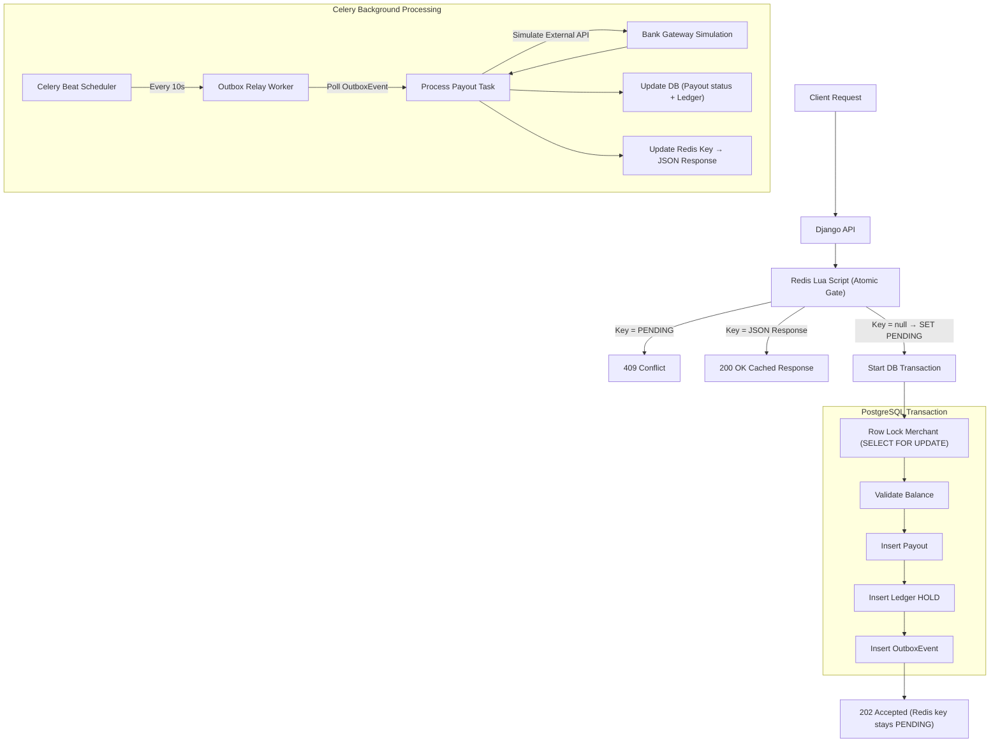

# Playto Payout Engine

A payment engine simulation designed with robust financial systems in mind, built using Django, DRF, PostgreSQL, Celery, and Redis. It features exact-once processing, Redis-based atomic idempotency using Lua scripts, strict row-level locking for balance management, and a transactional outbox pattern to guarantee event delivery.

## Architecture Overview

The system is designed to handle high concurrency without race conditions, overdrawn accounts, or duplicate processing.



### Key Architectural Decisions

1. **Redis-Only Idempotency**: To prevent duplicate payouts, the system relies on an `Idempotency-Key` header. An atomic Redis Lua script acts as the sole idempotency gate. The Lua script atomically checks if a key exists; if not, it sets it to `PENDING` with a TTL. If the key already exists as `PENDING`, the request is rejected with `409 Conflict`. If the key contains a JSON response (written by the Celery worker after payout completion), it is replayed as `200 OK`. No PostgreSQL `IdempotencyKey` table is needed — this eliminates an entire table, its indexes, migrations, and row-level lock contention under load.

2. **Ledger Over Mutable Balance**: Instead of storing a single mutable `balance` integer on the `Merchant` (which invites data corruption and race conditions), balances are derived dynamically using `SUM()` aggregations on an append-only `Ledger`.

3. **Pessimistic Row-Level Locking**: When modifying financial state, PostgreSQL's `SELECT ... FOR UPDATE` ensures only one request modifies a specific merchant's ledger at any exact millisecond.

4. **Transactional Outbox Pattern**: External systems (like bank gateways) are never called synchronously during the HTTP request. Instead, an `OutboxEvent` is committed to the database within the exact same transaction as the ledger hold. A Celery worker later relays these events, and upon completion, writes the final response JSON to Redis. This guarantees *exactly-once* delivery — even if the web server crashes immediately after sending a 202 response, the outbox worker will ensure the payout completes.

5. **Worker-Driven State Finalization**: The Celery worker is responsible for updating the Redis idempotency key from `PENDING` to the final JSON response once the payout reaches a terminal state (`SUCCESS` or `FAILED`). This ensures clients can replay their request and receive the correct final state.

---

## Setup Instructions

1. Ensure Docker and Docker Compose are installed on your machine for the backing services.
2. Start the infrastructure (PostgreSQL and Redis):
   ```bash
   docker-compose up -d
   ```
3. Activate the virtual environment:
   ```bash
   .\.venv\Scripts\activate
   ```
4. Run database migrations:
   ```bash
   python manage.py migrate
   ```

## Starting the Application

To run the full stack locally, you will need 3 separate terminal windows (with the `.venv` activated in each).

**Terminal 1: Django API Server**
```bash
python manage.py runserver
```

**Terminal 2: Celery Worker (Payout Processing)**
```bash
celery -A playto worker --loglevel=info -P gevent
```
*(Note: Windows users usually need to install and use `gevent` or `solo` pool for Celery).*

**Terminal 3: Celery Beat (Outbox Relay Watcher)**
```bash
celery -A playto beat --loglevel=info
```

## Running Tests
Run the test suite using `testcontainers` to automatically spin up an isolated PostgreSQL instance:
```bash
python manage.py test api
```

