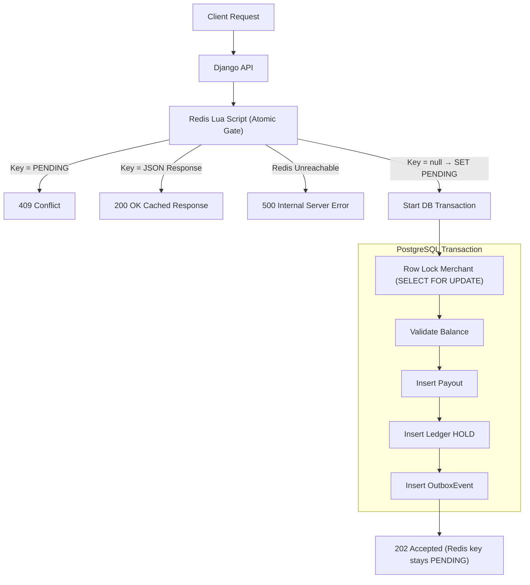
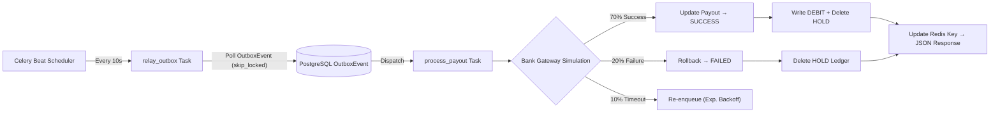
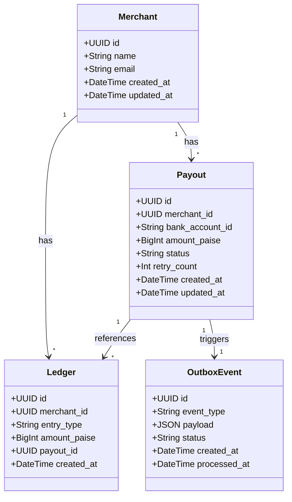
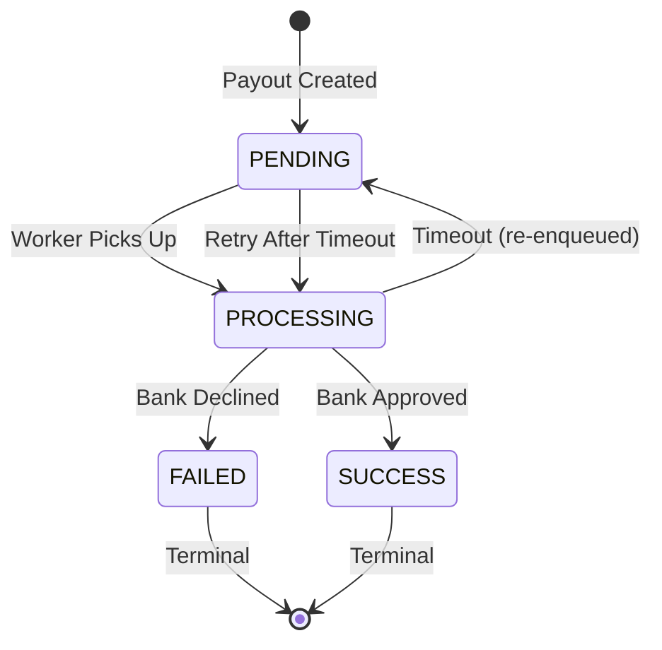

# Playto Payout Engine

A payment engine simulation designed with robust financial systems in mind, built using Django, DRF, PostgreSQL, Celery, and Redis. It features exact-once processing, Redis-based atomic idempotency using Lua scripts, strict row-level locking for balance management, and a transactional outbox pattern to guarantee event delivery.

---

## Architecture Overview

The system is designed to handle high concurrency without race conditions, overdrawn accounts, or duplicate processing.


### Client → Backend Request Flow



### Celery Outbox Worker Flow



### Key Architectural Decisions

1. **Redis-Only Idempotency**: An atomic Redis Lua script acts as the sole idempotency gate. If the key exists as `PENDING`, return `409 Conflict`. If it contains JSON (written by the Celery worker), replay it as `200 OK`. **If Redis is unreachable**, the API returns `500 Internal Server Error` — it cannot safely proceed without the idempotency gate.

2. **Ledger Over Mutable Balance**: Balances are derived dynamically using `SUM()` aggregations on an append-only `Ledger` rather than storing a mutable integer, eliminating race conditions.

3. **Pessimistic Row-Level Locking**: PostgreSQL's `SELECT ... FOR UPDATE` ensures only one request modifies a merchant's ledger at any given moment.

4. **Transactional Outbox Pattern**: An `OutboxEvent` is committed within the same transaction as the ledger hold. A Celery worker later relays these events, guaranteeing *exactly-once* delivery.

5. **Worker-Driven State Finalization**: The Celery worker updates the Redis idempotency key from `PENDING` to the final JSON response once the payout reaches a terminal state (`SUCCESS` or `FAILED`).

### Data Model



### Payout State Machine



---

## Docker Containers

The full stack runs as **6 containers** via `docker-compose.yml`:

| Container          | Image / Build          | Port  | Purpose                          |
|--------------------|------------------------|-------|----------------------------------|
| `playto-postgres`  | `postgres:15`          | 5432  | Primary database                 |
| `playto-redis`     | `redis:7-alpine`       | 6379  | Celery broker + idempotency gate |
| `playto-backend`   | `./Dockerfile`         | 8000  | Django API (Gunicorn)            |
| `playto-celery-worker` | `./Dockerfile`     | —     | Payout processing worker         |
| `playto-celery-beat`   | `./Dockerfile`     | —     | Periodic outbox relay scheduler  |
| `playto-frontend`  | `./web/Dockerfile`     | 5173  | React dashboard (Vite)           |

### Start all containers
```bash
docker compose up -d
```

### Stop all containers
```bash
docker compose down
```

---

## Local Development Setup

For local development, only PostgreSQL and Redis run in Docker. The Django server, Celery, and the frontend run natively.

### Prerequisites
- Docker & Docker Compose
- Python 3.11+ with a virtual environment
- Node.js 20+
- GNU Make (or use the commands directly)

### 1. Start Databases
```bash
make db-start
```

### 2. Activate Virtual Environment & Install Dependencies
```bash
# Windows
.\.venv\Scripts\activate
pip install -r requirements.txt

# macOS/Linux
source .venv/bin/activate
pip install -r requirements.txt
```

### 3. Run Migrations & Seed Data
```bash
make migrate
make seed
```

### 4. Start Services (each in a separate terminal)

| Terminal | Command           | Description                  |
|----------|-------------------|------------------------------|
| 1        | `make server`     | Django API on `localhost:8000` |
| 2        | `make celery-worker` | Celery worker (solo pool)  |
| 3        | `make celery-beat`   | Celery Beat scheduler      |
| 4        | `make frontend`      | Vite dev server on `localhost:5173` |

Create a `.env` file inside `web/` with your merchant UUID:
```
VITE_MERCHANT_ID=<your-merchant-uuid>
```

---

## Makefile Commands Reference

### Database Services
| Command         | Description                                        |
|-----------------|----------------------------------------------------|
| `make db-start` | Start PostgreSQL and Redis containers (detached)   |
| `make db-stop`  | Stop PostgreSQL and Redis containers               |
| `make db-logs`  | Tail logs from database containers                 |

### Django Backend
| Command        | Description                      |
|----------------|----------------------------------|
| `make server`  | Start the Django development server |
| `make migrate` | Run Django database migrations   |
| `make seed`    | Seed the database with test data |

### Celery
| Command              | Description                             |
|----------------------|-----------------------------------------|
| `make celery-worker` | Start Celery worker (solo pool for Windows) |
| `make celery-beat`   | Start Celery Beat scheduler             |

### React Frontend
| Command                 | Description                    |
|-------------------------|--------------------------------|
| `make frontend-install` | Install frontend npm dependencies |
| `make frontend`         | Start the Vite dev server      |

### Full Docker Stack
| Command            | Description                    |
|--------------------|--------------------------------|
| `make docker-up`   | Start all 6 containers         |
| `make docker-down` | Stop all containers            |
| `make docker-build`| Rebuild all Docker images       |
| `make docker-logs` | Tail logs from all containers  |

### Utilities
| Command       | Description                              |
|---------------|------------------------------------------|
| `make test`   | Run Django test suite                    |
| `make clean`  | Remove Docker volumes and stopped containers |
| `make help`   | Show all available commands              |

---

## Running Tests
Run the test suite using `testcontainers` to automatically spin up an isolated PostgreSQL instance:
```bash
make test
# or directly:
python manage.py test api
```
